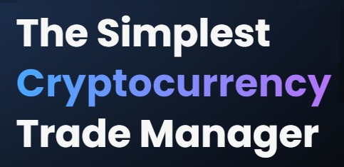

<!-- PROJECT LOGO -->
<br />
<div align="center">
  <a href="https://github.com/sextus-empiricus/bbg-fe">
    
  </a>

<h3 align="center">Baba Ghanoush</h3>

  <p align="center">
    The Simplest
Cryptocurrency
Trade Manager
    <br />
    <br />
    <a href="http://test.n5sjg7aubr.smallhost.pl/">View Demo</a>
  </p>
</div>


<!-- ABOUT THE PROJECT -->
## About The Project


Baba Ghanoush, cryptocurrency trade manager. The application allows tracking user’s cryptocurrency investments and its history. The user manually adds his current purchases to the application. The application stores the details of the purchase and informs him about the profit or loss, depending on the market situation.

### Built With


### Testing account
```
email: test@test.test
password: test1234
```

### More:
Back-End: [here](www.google.com)

### Contact:
